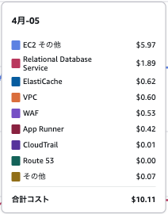

[tasks.compose-up-jaeger]
extend = "set-env-docker"
command = "docker"
args = ["compose", "up", "-d", "jaeger"]## rust api

This repository is the manual copy of [rusty-book-manager](https://github.com/rust-web-app-book/rusty-book-manager).  

### set up

```
docker compose up -d --build
```

Next, run below command to enable precommit hook to update db schema information automatically for sqlx macros.  

```
git config --local core.hooksPath .githooks
```

each task defined in Makefile.toml can be excuted by `cargo make run`  
Note that `cargo run` seems to work, but fails in reading env vars.  

```
// install cargo
cargo install --force cargo-make


// run [tasks.run-in-docker]
cargo make run-in-docker

// during development, if you want to restart local
cargo make compose-remove \
cargo make build \
cargo make initial-setup \
cargo make run
```

Optionally, conducive commands are executable.  

```
// test
cargo nextest run

// generate migration file
cargo make gen-migrate

// execute migration
cargo make migrate

// revert migration
cargo makme sqlx migrate revert

// you can debug with...
cargo mak --loglevel verbose run

// start creating new crate
cargo new --lib <crate name>
```

Also, common commands are usable.  

```
docker container exec -it rust-api-app-1 bash
```

### delivery process

You can deploy this project with AWS resources.  


1. setting OIDC provider

access id provider page in [IAM](https://us-east-1.console.aws.amazon.com/iam/home?region=us-east-1#/identity_providers) and create provider with following below.  

| attribute | value |
| ---- | ---- |
| provider type | select OpenID connect |
| provider URL | input `token.actions.githubusercontent.com` |
| target | input `sts.amazonaws.com` |

After this, [access settings > secrets > actions page](https://github.com/hiro-lapis/rust-api-axum/settings/secrets/actions) in this project and set `AWS_ACCOUNT_ID` that can be seen at upper right on AWS console.  
Make sure to set the id owner user have permission `sts:AssumeRoleWithWebIdentity`.

2. create ECR repository

Access [Elastic Container Registry](https://ap-northeast-1.console.aws.amazon.com/ecr/get-started?region=ap-northeast-1) on AWS console and create a repository.  

Make sure that following below.  

- create the repository in the `ap-northeast-1` region where this project will be deloyed.  
- the repository name must be `rust-api` or the same name of `backend_repository.name` in `infra/app/main.tf` and `REPOSITORY` of `.github/workflows/deploy_app.yaml`

You don't have to care about mutability and bcrypt type settings.  
Bcrypt type of `AES-256` is common.  
Immutable in mutability is more secure becayse this setting can protect the overwrite of container image from attacker.  
That being said, if you want to deploy this project as a personal practice project, mutable is ok.  

3. create and push tag
```
git tag -a release-v1.1.3 -m "release new func"
git push origin release-v1.1.3

```


4. wait for finishing github action's process which push container to ECR

5. deploy terraform resource

Note that if deploy terraform resources before 2, the deploy will fail due to the lack of ECR container.  

```
cd infra
terraform plan
terraform apply
```

6. set environment variables for the production application

access [secret manager](https://ap-northeast-1.console.aws.amazon.com/secretsmanager/listsecrets?region=ap-northeast-1) on AWS console.  

| key | page |
| ---- | ---- |
| DATABASE_HOST | [RDS end point](https://ap-northeast-1.console.aws.amazon.com/rds/home?region=ap-northeast-1) |
| DATABASE_PASSWORD | [DB variables are automatically generated on secret manager](https://ap-northeast-1.console.aws.amazon.com/secretsmanager/listsecrets?region=ap-northeast-1) |
| REDIS_HOST | [Elastic cache end point](https://ap-northeast-1.console.aws.amazon.com/elasticache/home?region=ap-northeast-1#/dashboard) |

Note that sometimes DATABASE_PASSWORD contains `%` in password. If this case, `%` must be percentcoded like `%25`.  

Mock values' of `JAEGER_HOST` and `JAEGER_PORT` are ok because currently this project doesn't have JAEGER resources in production.  

7. execute initialization.

Access [code build](https://ap-northeast-1.console.aws.amazon.com/codesuite/codebuild/projects?region=ap-northeast-1&projects-meta=eyJmIjp7InRleHQiOiIiLCJzaGFyZWQiOmZhbHNlLCJ0YWdnZWQiOmZhbHNlfSwicyI6eyJwcm9wZXJ0eSI6IkxBU1RfTU9ESUZJRURfVElNRSIsImRpcmVjdGlvbiI6LTF9LCJuIjoyMCwiaSI6MH0) and run `book-manager-database-migration` build project  prepared by terraform.  

8. deploy frontend and set env to integrate api

access [Amplify](https://ap-northeast-1.console.aws.amazon.com/amplify/apps) and deploy frontend by integrate with github.  

Set environment variables can be done on setting page like https://ap-northeast-1.console.aws.amazon.com/amplify/apps/<app_id>/variables.  

| key | page |
| ---- | ---- |
| API_ROOT_URL | [app runner end point](https://ap-northeast-1.console.aws.amazon.com/apprunner/home?region=ap-northeast-1#/welcome), like testest.ap-northeast-1.awsapprunner.com |

9. Set access control

If you want to restrict acceess, Access control (Basic autholization) is useful.  
Access manage access control page on amplify `https://ap-northeast-1.console.aws.amazon.com/amplify/apps/<app_id>/access`
, and set username and password.  

### Costs

Some resouces are pay as you go, some bill just by provisioning.  
Please make sure that destroy resources after use.  



Specifically, container images in ECR have to be deleted in AWS console which cannot be deleted by `terraform destroy`.  


### logging

`http://localhost:16686` is serverd as tracing logger by jaeger container.  

`http://127.0.0.1:8080/docs` is served as OpenApi docs
